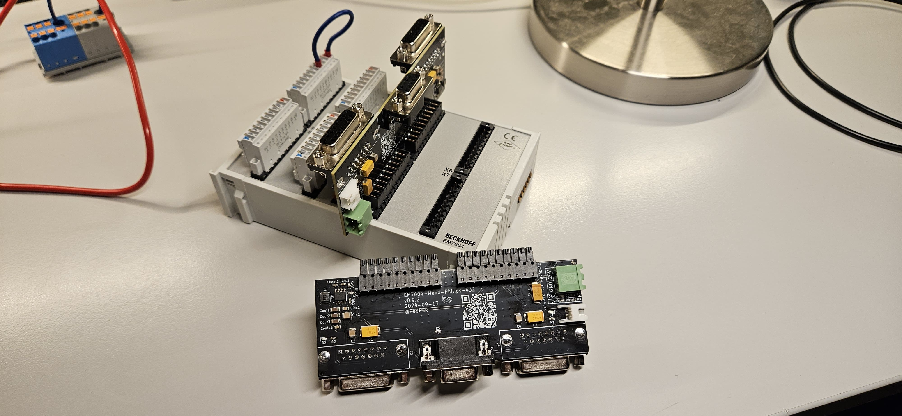

# EM7004-Maho-Philips-432 (WIP! - UNTESTED!)
Retrofit analog interface adaptor for Maho CNC machines with a Philips 432/10 controller for use with a [Beckhoff EM7004](https://www.beckhoff.com/de-de/produkte/i-o/ethercat-klemmen/el-elm7xxx-kompakte-antriebstechnik/em7004.html) 

This project is used in the [Maho400E-LinuxCNC Retrofit project](https://github.com/PedPEx/Maho400E-LinuxCNC).

## Milestones
accomplished Milestones / ToDo:
- ✅ ready to go prototype at hand (v0.9.2 - corrected)
- ✅ working buck converter
- 🔲 tested with Maho axis attached
    - 🔲 working glass scale readout
    - 🔲 working Indramat speed controll

## Powering
The board needs a seperate supply voltage input to power the Philips converter-board (similar to Heidenhain EXE) for the encoders. The 5 V regulator is based around a [Texas Instruments LM33630](https://www.ti.com/product/LMR33630) and onboard. The BuckConverter part is based on the design from this [repository](https://github.com/PedPEx/BuckConverter_Enable). I recommend the [Phoenix Contact - 1962600 - TFKC 2,5/ 2-ST-5,08](https://www.phoenixcontact.com/de-de/produkte/leiterplattenstecker-tfkc-25-2-st-508-1962600) connectors to simply daisy chain all EM7004 24 V power supply lines.

## Usage
The pcb can be pretty easily assembled with standard parts of of LCSC (for furter information look at the [Online BOM](#online-preview--bom)). The connectors on the other side for plugging into the Beckhoff Module on the other hand are somewhat special. Unfortunately i found not a single alternative to the [Phoenix Contact - 1830498 - IMC 1,5/10-G-3,5 P20 THR](https://www.phoenixcontact.com/de-de/produkte/leiterplattengrundleiste-imc-1510-g-35-p20-thr-1830498) connectors, and these are not cheap at all. You can get five of them for free for testing purposes.

The first batch of boards is used in the testbench for the [Maho400E-LinuxCNC Retrofit project](https://github.com/PedPEx/Maho400E-LinuxCNC). LCSC did have a fault in the footprint files of the DB15 connectors, they were mirrored by accident. The fault has been fixed in v0.9.3 and the connectors were placed on the underside of the PCB in order to test the boards for functionality.

## Saving costs
In order to save some money, a JST right beside the 24V input connector is provided to power other adaptors and not needing an additional buck converter onboard of the other PCBs. Just daisy chain all adaptor interfaces. The BOM needs to be adjusted accordingly for that use case (ToDo).

## Limitations
In our Maho 400E with the original Philips 432/10 controller the encoder converter card is labeled "Maho 27.69 658" on the top and no label on the bottom. It seems to be a standard Heidenhain part (Part#: 229 281 01). Example pictures are avaliable [here](https://www.cnc-shopping.com/en/philips-432-cnc-heidenhain-229-281-01-exe-platine-maho-27-69-658-3-axis-615dc0edd3849-p-5395.html). This project is specifically meant to be used with this MAHO part!

Keep in mind this adaptor is not suited for use with a standard [Heidenhain EXE 600/900](https://cncbote.de/artikel/heidenhain-exe-600-5-f-id-nr-172680a/) series converter. These need an extra 12 V supply and other connectors.

## Online Preview / BOM / Schematic
[Online BOM](https://htmlpreview.github.io/?https://raw.githubusercontent.com/PedPEx/EM7004-Maho-Philips-432/main/bom/webviewer-BOM.html)

[PDF Schematic](https://github.com/PedPEx/EM7004-Maho-Philips-432/blob/main/EM7004-Maho-AxisAdaptor.pdf)

## Software part
This board is meant to be used with a EM7004 module and LinuxCNC. The LinuxCNC software part can be found here: [Maho400E-LinuxCNC](https://github.com/PedPEx/Maho400E-LinuxCNC)

## Note
The pictures were rendered with the help of Blender and the [pcb2blender](https://github.com/30350n/pcb2blender) plugin and the HTML BOM was created with [InteractiveHtmlBom](https://github.com/openscopeproject/InteractiveHtmlBom).
